# Super Calculator

    

**An all-in-one scientific calculator, CAS, 2D/3D plotter, data lab, and interactive math playground — packed into one Windows .exe. No install, no Python, no admin rights.**

Drop a CSV on it and it profiles your data. Click "Mandelbrot" and zoom into it with your mouse. Type `integrate(sin(x)/x, x)` and watch the symbolic result render in LaTeX. Slide the Fourier slider and watch a square wave assemble itself from sine waves. Everything that used to live in five different apps is now one button-click away.

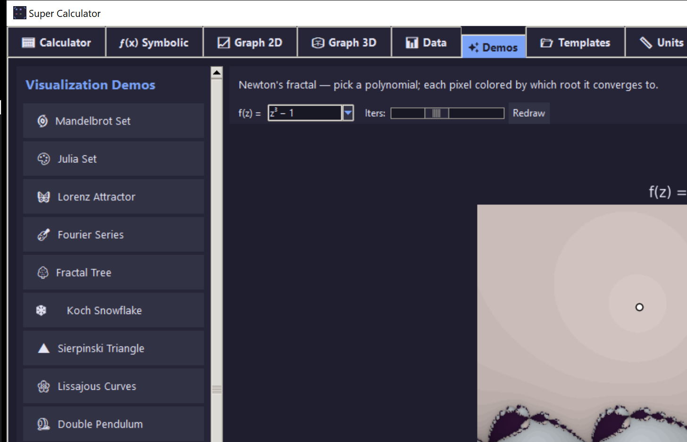

## Quick Start

### 1. Download

Grab **[SuperCalc.exe](../../releases/latest/download/SuperCalc.exe)** (~80 MB) from the latest Release.

### 2. Run

Double-click `SuperCalc.exe`. Windows SmartScreen may ask once — click **More info → Run anyway**. No installer, no admin, no Python required.

### 3. Play

The app opens to the Calculator. Try clicking through the 9 tabs across the top, then visit the **✨ Demos** tab — every visualization there is interactive (sliders, click-to-zoom, drag-to-spin).

## Features

### 🧮 Calculator
Scientific arithmetic with full sympy backend. Trig (deg/rad toggle), logs, factorials, complex numbers, every Greek constant. One-click **Functions** and **Constants** dropdowns insert 30+ extra math functions and 17 physical constants directly into the display. Side panel shows live history and named variables.

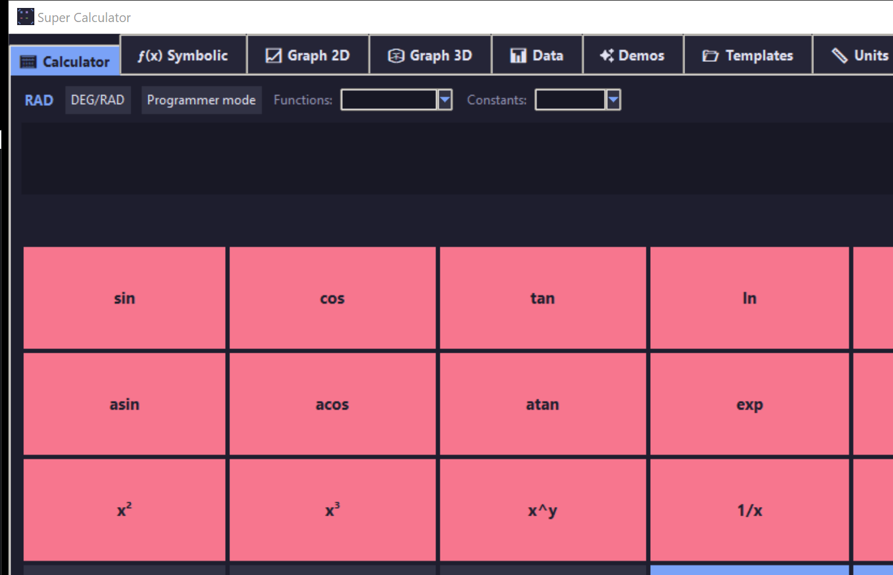

**Programmer mode** swaps the keypad to a bitwise layout — hex A–F digits, AND/OR/XOR/NOT/shift, and BIN/OCT/HEX base prefixes. Results show simultaneously in all four bases.

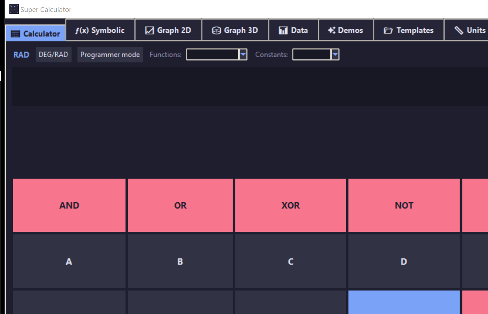

### ƒ(x) Symbolic / CAS
SymPy-powered computer algebra: simplify, expand, factor, differentiate, integrate (definite and indefinite), limits, series, solve, substitute. Results render in pretty LaTeX. One-click export as Python code or LaTeX. Quick-pick chips for common points (0, π/2, π, ∞, …) and a curated dropdown of example expressions.


### 📈 Graph 2D
Six plot kinds in one tab: **explicit** `y=f(x)` with multi-curve overlay, **parametric** `(x(t), y(t))`, **polar** `r=f(θ)`, **implicit** `F(x,y)=0`, **vector fields** (with streamlines), and **slope fields** for ODEs. Each kind has a curated *Pick example* dropdown with classics like the heart curve, butterfly curve, rose patterns, and the folium of Descartes.

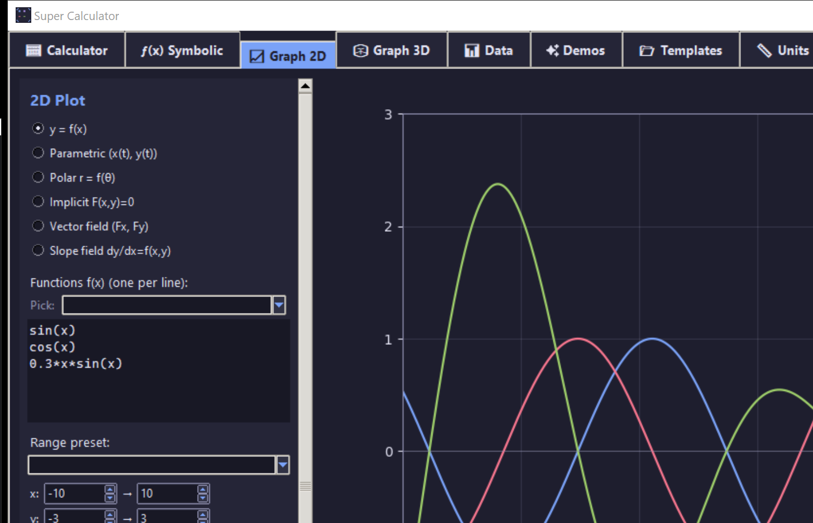

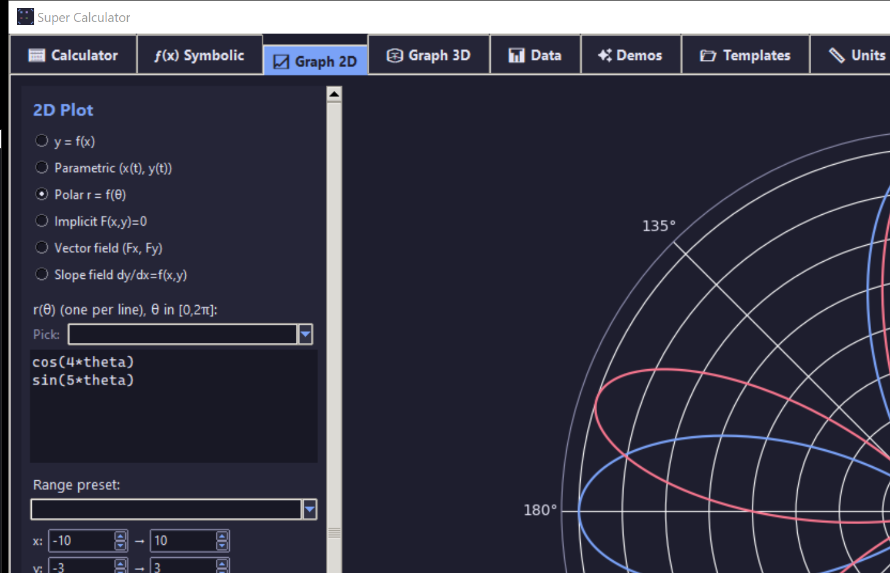

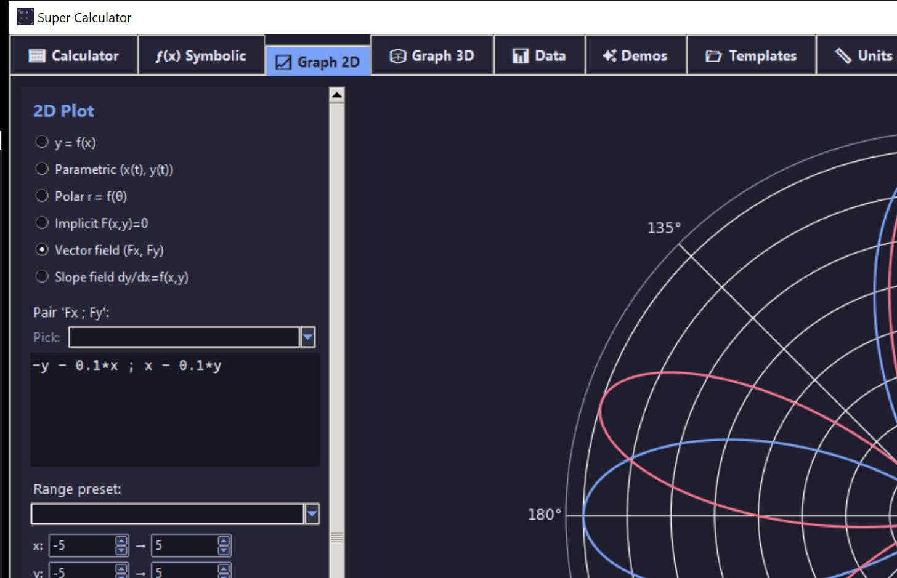

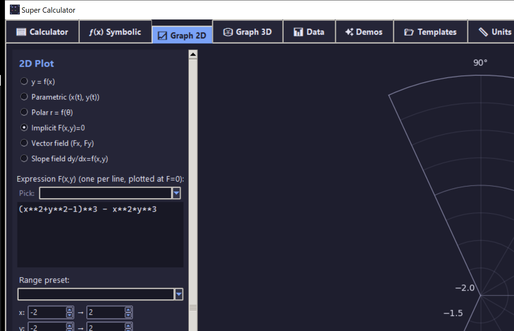

### 🧊 Graph 3D
Surfaces, wireframes, filled contours, 3D parametric curves (torus knots, spirals), and **complex domain coloring** (HSV phase plots of complex functions). Drag to rotate, zoom with the toolbar.

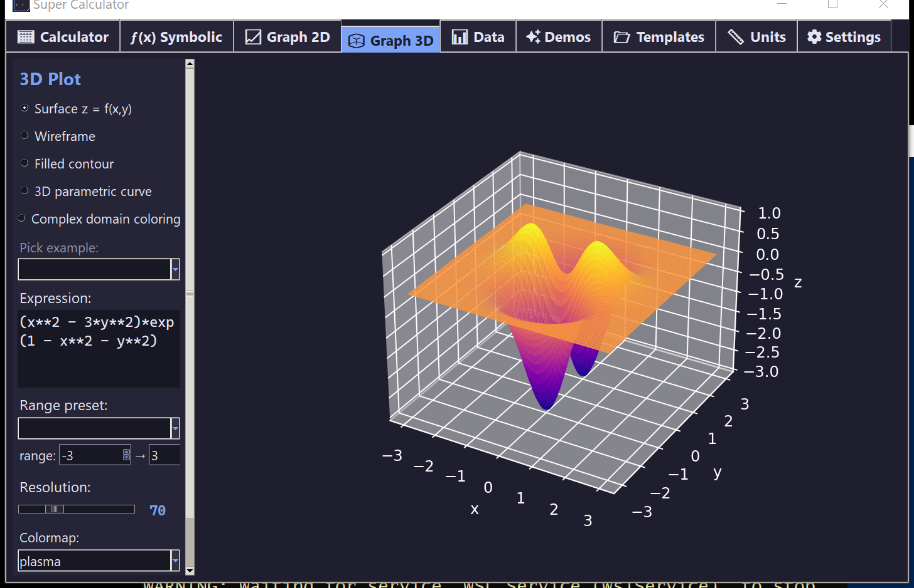

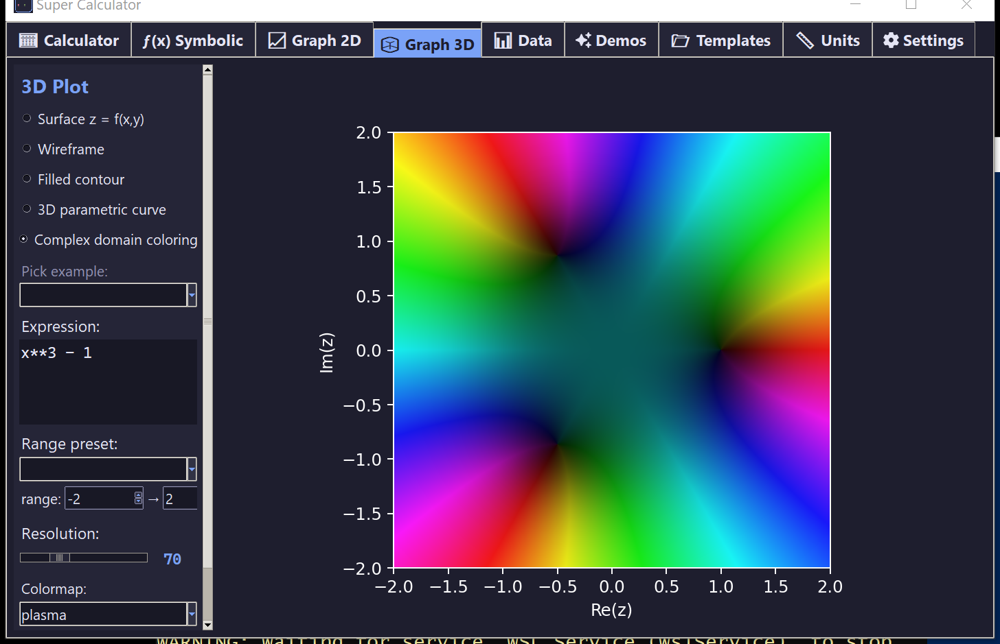

### 📊 Data
Drop any CSV on the drop zone — the app auto-detects column types, computes summary statistics, and offers histogram / scatter / line / bar / box / scatter-matrix / correlation-heatmap plots. Built-in regression fits: linear, polynomial (2/3), exponential, logarithmic, and power — with the equation and R² overlaid. Built-in iris-like sample loads in one click for trying it out.


### ✨ Demos
**17 interactive visualizations**, every one click-to-explore:

| Demo | Interaction |
|------|------------|
| 🌀 Mandelbrot | Click to zoom 4× into any point; right-click to zoom out |
| 🎨 Julia set | Drag Re(c)/Im(c) sliders to morph the fractal in real time |
| 🦋 Lorenz attractor | Animated 3D butterfly chaos (RK4 integrated) |
| 🎻 Fourier series | Slide N harmonics; pick square / triangle / sawtooth target |
| 🌳 Fractal tree | Angle and depth sliders for an L-system tree |
| ❄️ Koch snowflake | Order slider 0–6 |
| 🔺 Chaos game | Vertices slider 3–8; Points slider; auto-adjusted contraction ratio |
| 🌸 Lissajous | a/b/phase sliders |
| 🪀 Double pendulum | Live RK4 simulation; two pendulums with 0.001 rad offset diverge into chaos |
| 🌌 Game of Life | Click cells, pause/play, randomize, R-pentomino preset |
| 🎯 Buffon's needle | Drops actual needles on a striped floor (red = crosses a line); N slider + live π estimate plot side-by-side |
| 🎲 Monte Carlo π | Slider for N; running π estimate curve next to the disc scatter |
| 🪐 3-body orbits | Live gravitational sim, three masses, beautiful traces |
| 🌊 Wave equation | 2D wave PDE solver, animated ripple |
| 🔢 Collatz | Pick any starting n; chips for famous values (27, 97, 6171, 77031) |
| 🎢 Bifurcation | Logistic map; click to zoom into period-doubling regions |
| 🔄 Newton's fractal | Polynomial dropdown (8 polynomials) + iteration slider |

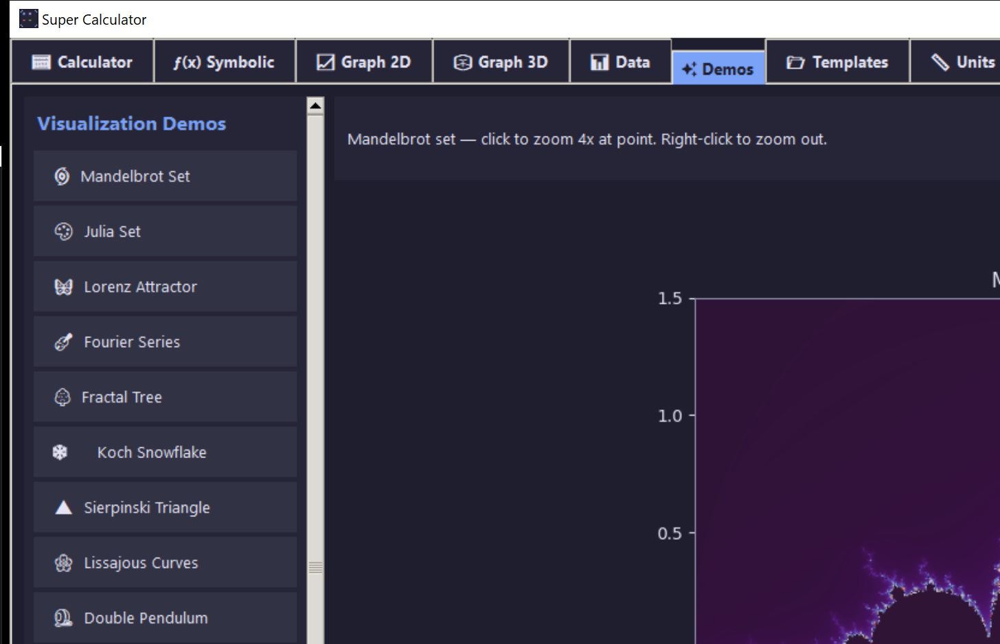


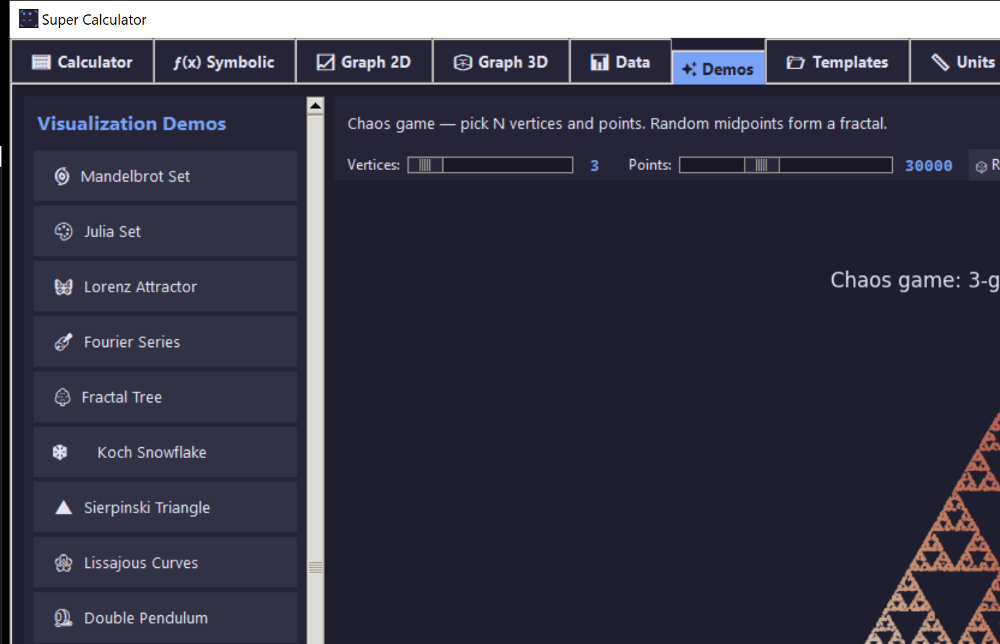

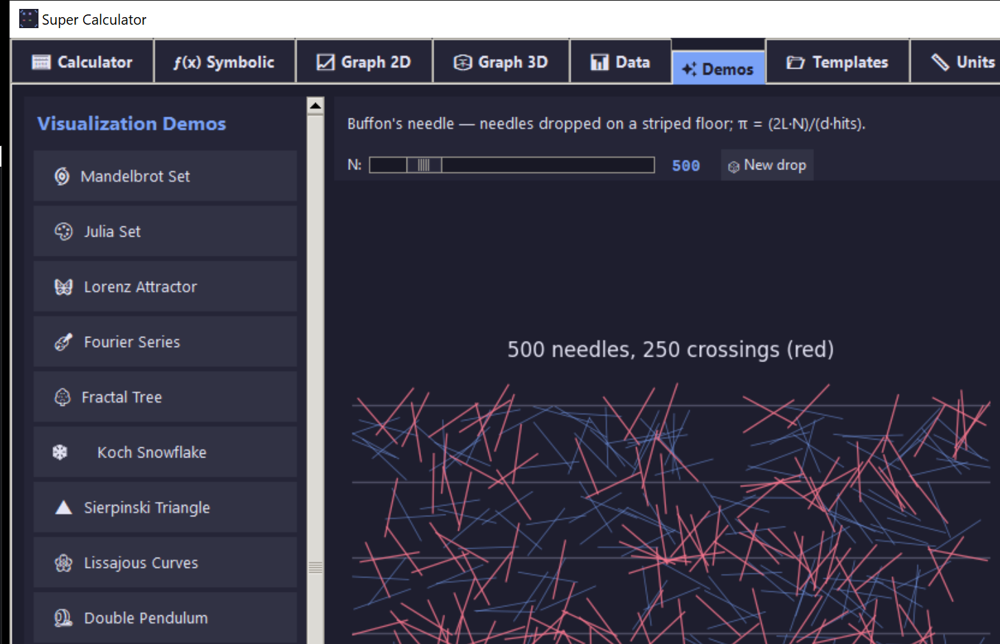

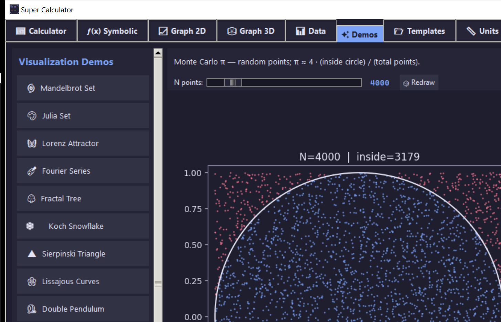

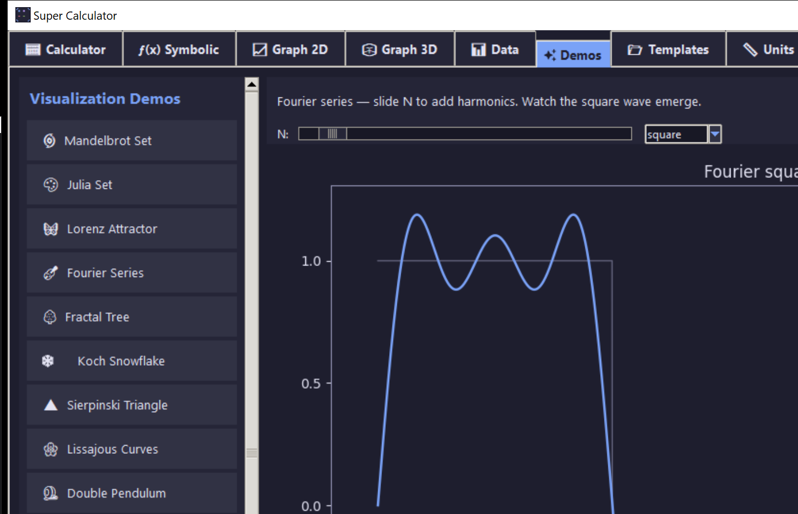

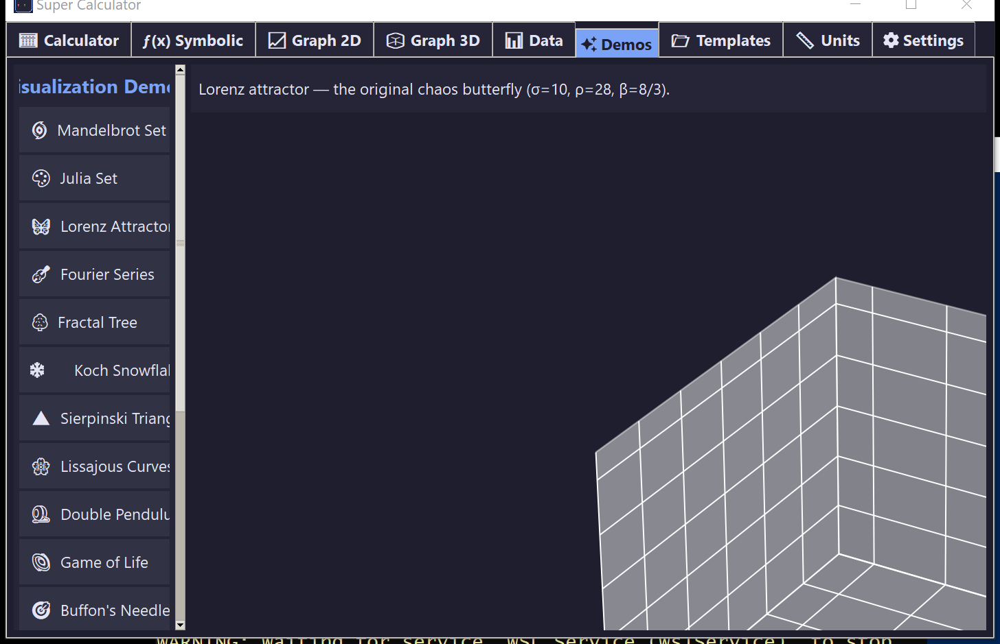

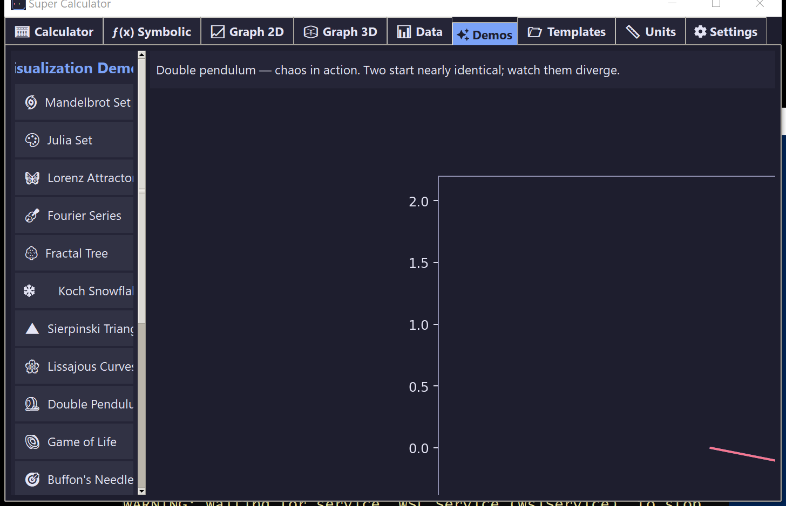

### 📂 Templates
18 click-to-load examples spanning algebra, calculus, ODEs, physics, statistics, finance, and number theory. Click → loads the example into the relevant tab.


### 📏 Units & Constants
7 unit categories (length / mass / time / energy / pressure / data / angle), 17 physical constants table with descriptions. Double-click any constant to insert it into the calculator.


### ⚙️ Settings
4 themes (Dark, Light, Synthwave, Solarized) applied to both Tk widgets and matplotlib at once. Angle-mode default (deg/rad), display precision (4–30 significant digits).


## Requirements

- **Windows 10 or 11** (the .exe is a Windows binary)
- **~200 MB free disk** (extracts at runtime to `%TEMP%`)
- **Nothing else.** Python, NumPy, SciPy, SymPy, Matplotlib, and Tkinter are all bundled inside the exe.

## Folder Structure

```
super_calculator/
├── super_calc.py          ← single-file Python source (~2700 lines)
├── build.ps1              ← rebuilds the .exe with PyInstaller
├── README.md
├── LICENSE                ← MIT
├── .gitignore
├── docs/
│   ├── Home.md            ← wiki index
│   ├── Calculator.md
│   ├── Symbolic.md
│   ├── Graphs.md
│   ├── Data.md
│   ├── Demos.md
│   ├── Templates.md
│   ├── Units.md
│   ├── Settings.md
│   ├── Building.md
│   └── images/            ← all screenshots (33 PNGs)
└── dist/
    └── SuperCalc.exe      ← the binary you ship
```

## Building from Source

Requirements: Python 3.10+, pip. From the repo root:

```powershell
pip install numpy scipy sympy matplotlib pillow pyinstaller tkinterdnd2
.\build.ps1
```

The resulting `dist\SuperCalc.exe` is the same single-file binary you can ship anywhere. Build takes ~5 minutes; the output is ~80 MB.

To **develop without rebuilding**, just run:

```powershell
python super_calc.py
```

## Troubleshooting

| Symptom | Fix |
|---------|-----|
| Windows SmartScreen blocks first launch | Click **More info → Run anyway**. The exe is unsigned (signing certificates cost money). |
| Slow first launch | First run unpacks the bundled Python + libraries to `%TEMP%`. Subsequent launches are faster. |
| Drag-and-drop CSV doesn't work | The exe ships with `tkinterdnd2` bundled. If it fails silently, click the drop zone to use the file picker. |
| 3D plot looks black | Click the matplotlib toolbar's home icon to reset the view, or drag to rotate. |
| Demo animations stutter | Press **Esc** to stop, then click the demo again. The "⏹ Stop animations" button does the same. |
| Theme change doesn't update all elements | Theme switch rebuilds the tab system — re-open whatever tab you were on. |

## Tech Stack

- **GUI**: Tkinter + ttk + `tkinterdnd2` (drag-and-drop)
- **Math**: NumPy, SciPy, SymPy
- **Plotting**: Matplotlib (embedded via `FigureCanvasTkAgg`)
- **Imaging**: Pillow (for LaTeX rendering, icon, screenshots)
- **Packaging**: PyInstaller `--onefile --windowed`

## Credits & License

Built by [@aivrar](https://github.com/aivrar) with [Claude Code](https://claude.com/claude-code).

Released under the [MIT License](LICENSE).
