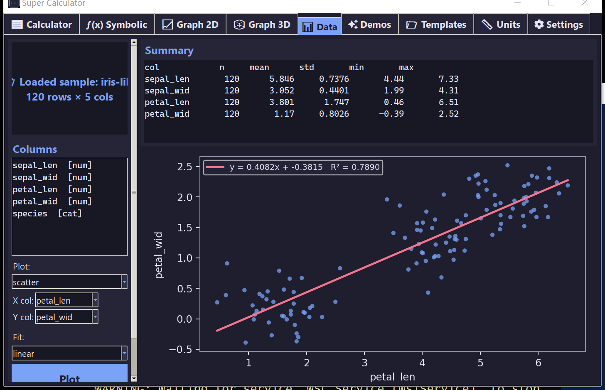
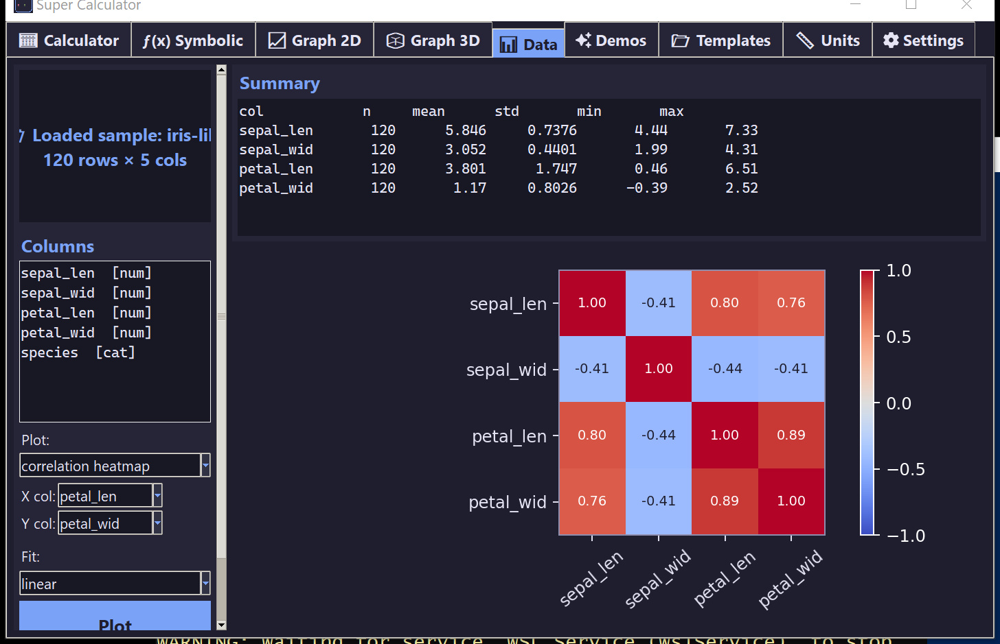
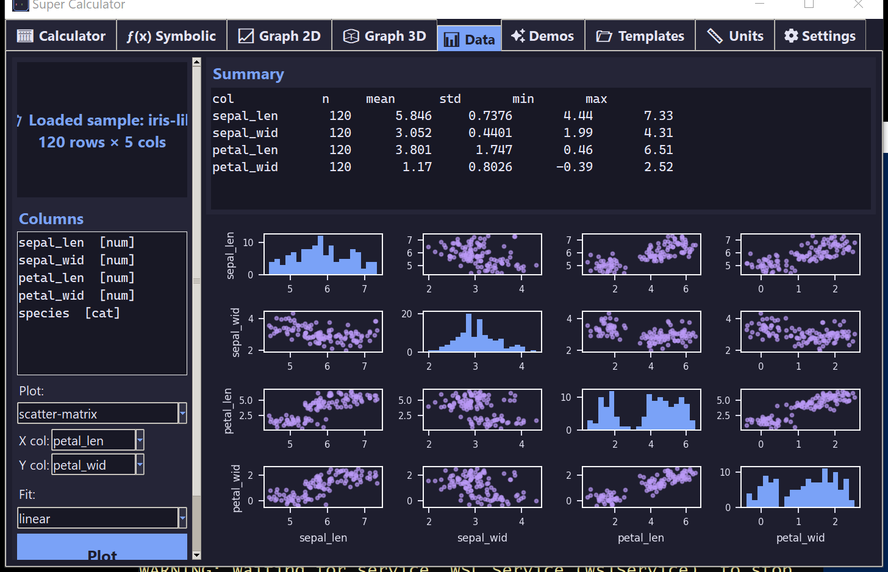

# 📊 Data

Drop a CSV on the drop zone and the app auto-profiles your data: detects column types, computes summary statistics, and offers a menu of plots and regression fits.

## Loading data

Three ways:

1. **Drag and drop** a `.csv`, `.tsv`, or `.txt` file onto the drop zone.
2. **Click** the drop zone to open a file picker.
3. **Load sample (Iris)** button — generates a 120-row iris-like sample so you can play immediately.

CSV parsing is automatic: comma/semicolon/tab/pipe-delimited files all work; header row detected heuristically.

## Summary panel

After load, the **Summary** box on the right shows per-column statistics: `n`, `mean`, `std`, `min`, `max`. Non-numeric columns are skipped.

The **Columns** list on the left shows each column with its inferred type — `[num]` if more than 60% of values parse as numbers, otherwise `[cat]`.

## Plot kinds

Pick from the **Plot** dropdown:

| Plot | Uses |
|------|------|
| `auto` | Histogram if X = Y, else scatter |
| `histogram` | Bins of the X column |
| `scatter` | X vs Y (with optional regression fit overlaid) |
| `line` | X vs Y as a sorted line plot |
| `bar` | Top-20 value counts of X (works on categoricals) |
| `box` | Box plots of every numeric column |
| `scatter-matrix` | Pairs plot of up to 5 numeric columns |
| `correlation heatmap` | Pearson correlation matrix with values overlaid |

## Regression fits

For scatter plots, set the **Fit** dropdown to overlay one of:

- **linear** — `y = a·x + b`
- **polynomial-2** — `y = a·x² + b·x + c`
- **polynomial-3** — cubic
- **exponential** — `y = a · exp(b·x)` (requires y > 0)
- **logarithmic** — `y = a · ln(x) + b` (requires x > 0)
- **power** — `y = a · x^b` (requires x, y > 0)

The fit equation and R² are shown in the legend.
