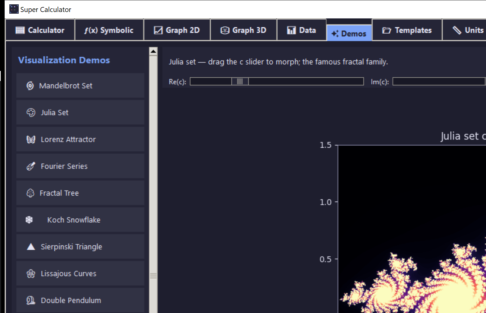
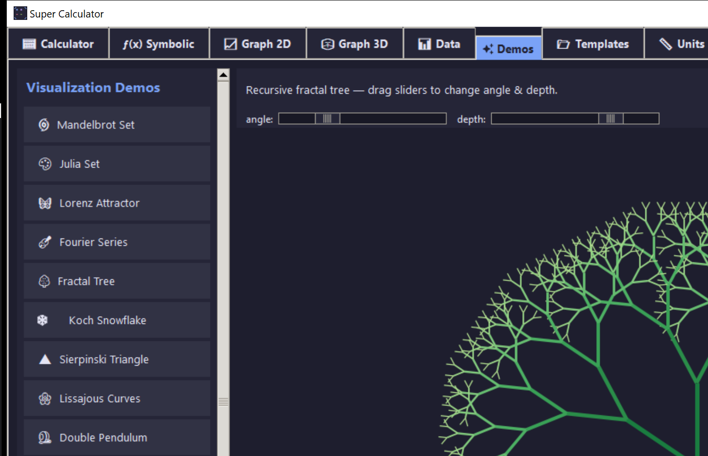
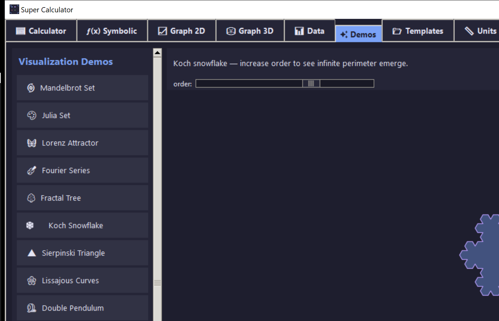
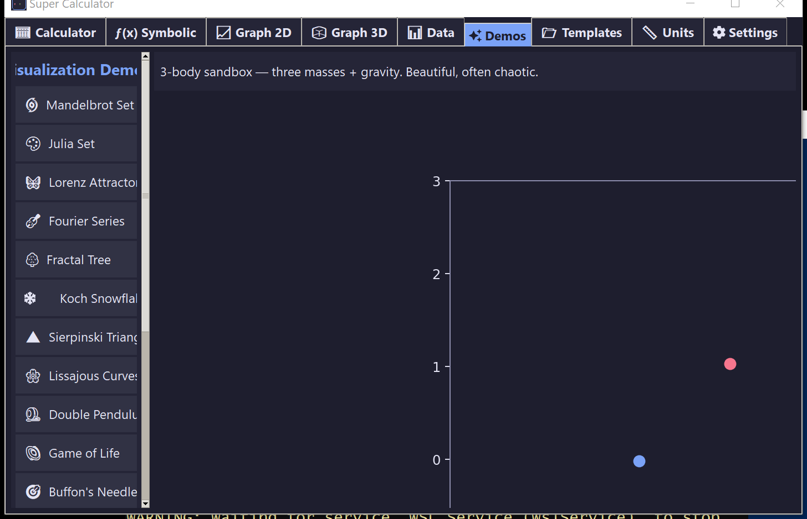
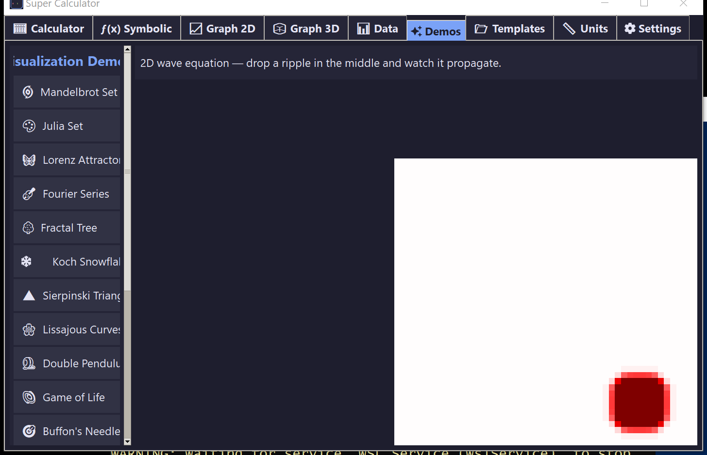
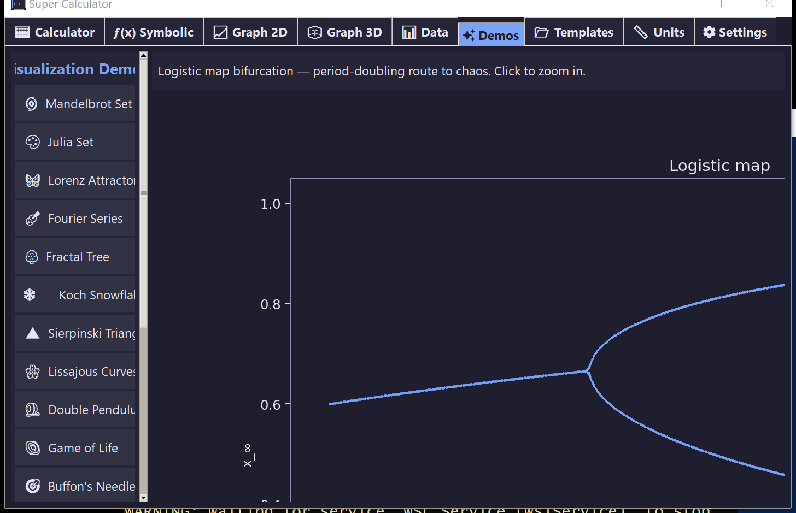
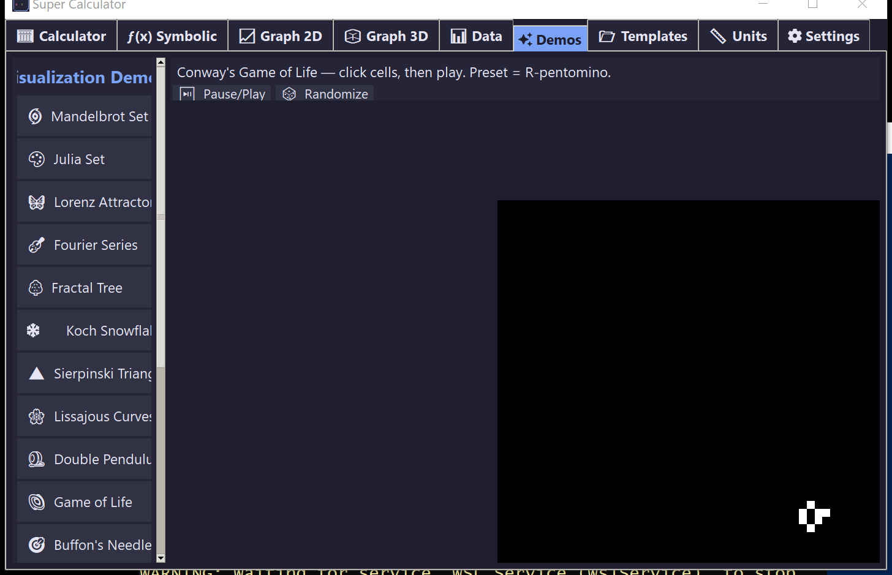
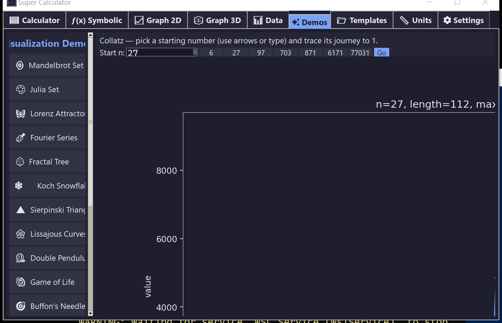
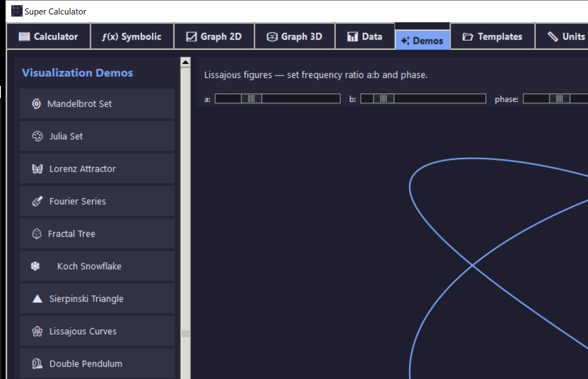

# ✨ Demos

17 interactive math visualizations. Each demo has sliders, click-to-zoom, or live animation.

Click **⏹ Stop animations** (or press **Esc**) before switching demos — animations don't auto-stop just because you opened a new one.

## Fractals

### 🌀 Mandelbrot set
Click anywhere to **zoom in 4×** at that point. Right-click to zoom back out. Iteration depth auto-adjusts so deep zooms still resolve detail.

### 🎨 Julia set
Drag the **Re(c)** and **Im(c)** sliders to morph the fractal in real time. Try `c = -0.7 + 0.27i` (the default) — it's one of the famous "dendrite" Julias.

### 🔄 Newton's fractal
Each pixel is colored by which root Newton's method converges to. Pick from 8 polynomials in the dropdown; the iteration slider controls how deep to chase convergence.

### 🔺 Sierpinski / chaos game
Pick the number of vertices (3 = classic Sierpinski triangle, 4 = carpet, 5–8 = exotic gaskets). The contraction ratio auto-adjusts so each n-gon stays clean.

### 🌳 Fractal tree
L-system tree. Two sliders: branching **angle** and recursion **depth**.

### ❄️ Koch snowflake
Order slider 0 (triangle) to 6 (≈ 100k segments). Watch perimeter explode.

## Probability & Monte Carlo

### 🎯 Buffon's needle
Needles dropped on a striped floor. Red needles cross a line; blue ones don't. The running π estimate `(2L·N)/(d·hits)` plots alongside.

### 🎲 Monte Carlo π
N points in a unit square; ratio inside the unit circle × 4 ≈ π. Left panel is the scatter; right panel is the running estimate vs. true π.

## Dynamical systems

### 🦋 Lorenz attractor
The original chaos butterfly. RK4 integrated with σ=10, ρ=28, β=8/3, animated as a growing 3D curve.

### 🪀 Double pendulum
Two pendulums start with a 0.001-radian difference and diverge into chaos. The traced tips show the divergence.

### 🪐 3-body gravity
Three equal masses with gravity. Beautiful and almost always chaotic.

### 🌊 2D wave equation
A ripple is dropped in the center of a 80×80 grid; the PDE is integrated and you watch it propagate. Fixed boundaries reflect.

### 🎢 Logistic-map bifurcation
The period-doubling route to chaos. Click anywhere to zoom in on that region — the cascade is fractal.

## Discrete

### 🌌 Conway's Game of Life
Click cells to toggle, Pause/Play to start/stop, Randomize for noise. Preset = R-pentomino.

### 🔢 Collatz sequence
Pick any starting `n` (or click a famous one: 27, 97, 6171, 77031) and watch the orbit until it reaches 1.

## Waves & curves

### 🎻 Fourier series
Slide N harmonics and watch the partial sum converge to a target wave (square / triangle / sawtooth).

### 🌸 Lissajous curves
Three sliders: frequency ratio `a:b` and phase. Classic oscilloscope patterns.

