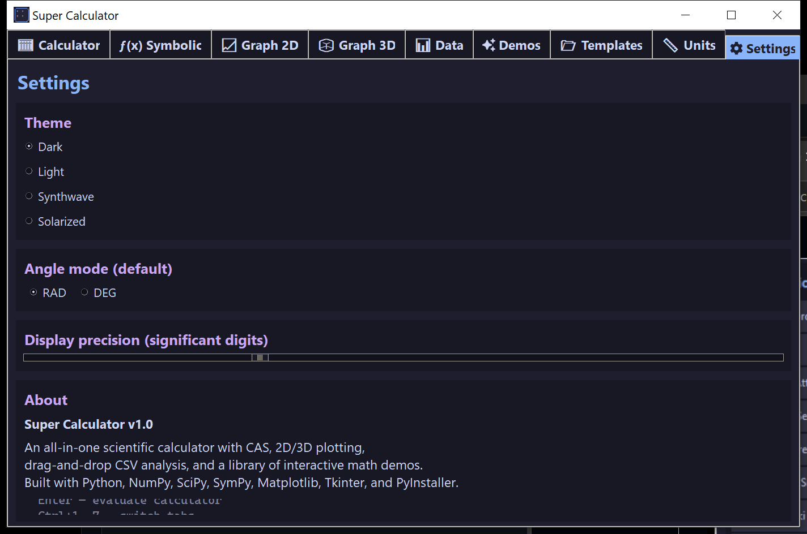

# ⚙️ Settings

## Theme

Four themes apply to *both* the Tk widgets and the matplotlib plots:

- **Dark** — default; deep navy + soft pastel accents
- **Light** — classic white background
- **Synthwave** — magenta-on-purple
- **Solarized** — the popular low-contrast palette

Changing theme rebuilds every tab (you'll briefly see the UI re-render).

## Angle mode

Toggle between **Radians** and **Degrees** as the default. Trig functions (sin/cos/tan/asin/acos/atan) interpret/return their inputs/outputs accordingly. Hyperbolics always work in radians. You can also flip this from the Calculator's top toolbar at any time.

## Display precision

Significant digits used when formatting numeric results. Range 4–30, default 12.

## Keyboard shortcuts

| Key | Action |
|-----|--------|
| **Enter** (in Calculator) | Evaluate the expression |
| **Ctrl + 1 … 9** | Switch to tab 1 through 9 |
| **Esc** | Stop any running demo animation |

## About

The Settings tab's "About" box lists the version, build credits, and the same keyboard shortcuts.
