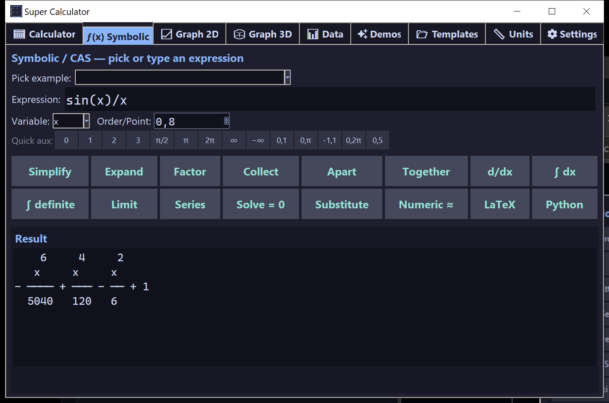
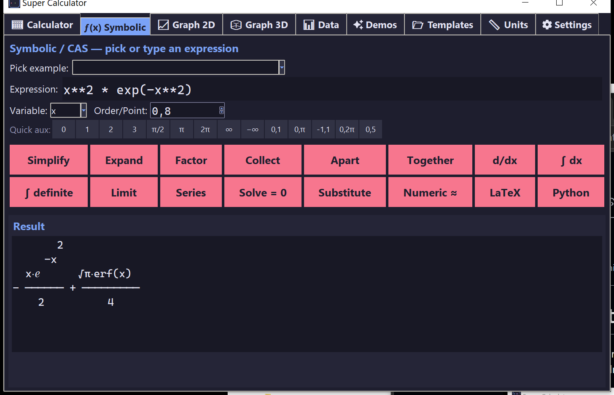

# ƒ(x) Symbolic / CAS

A SymPy-powered computer algebra system. Type an expression, pick an operation, get the symbolic result rendered as LaTeX.

## Operations

| Button | What it does | Aux argument |
|--------|-------------|-------------|
| **Simplify** | Algebraic simplification | — |
| **Expand** | Expand products and powers | — |
| **Factor** | Factor polynomials and integers | — |
| **Collect** | Collect terms in the chosen variable | — |
| **Apart** | Partial-fraction decomposition | — |
| **Together** | Combine into a single fraction | — |
| **d/dx** | Differentiate (any order) | order, e.g. `2` for 2nd derivative |
| **∫ dx** | Indefinite integral | — |
| **∫ definite** | Definite integral | `a,b` (e.g. `0,pi`) |
| **Limit** | Limit at a point | point, e.g. `0`, `oo`, `-oo` |
| **Series** | Taylor / Laurent series | `point,order` (e.g. `0,8`) |
| **Solve = 0** | Find roots / solutions | — |
| **Substitute** | Plug a value | `x=2` or `x=pi/2` |
| **Numeric ≈** | Floating-point evaluation | — |
| **LaTeX** | Render expression as LaTeX | — |
| **Python** | Render expression as Python code | — |

## Inputs

- **Pick example** — dropdown of 16 curated expressions for instant experimentation.
- **Expression** — anything sympy can sympify (e.g. `sin(x)^2 + cos(x)^2`, `(x+1)*(x-1)*(x-2)`, `a*x^2 + b*x + c`).
- **Variable** — dropdown (`x`, `y`, `z`, `t`, `theta`, `w`, `n`, `a`, `b`, `k`).
- **Order/Point** — spinbox + a row of quick-pick chips: `0`, `1`, `2`, `3`, `π/2`, `π`, `2π`, `∞`, `-∞`, `0,1`, `0,π`, `-1,1`, `0,2π`, `0,5`.

## Output

The result panel shows the expression three ways:

1. **Pretty-printed text** — sympy's monospace ASCII art (good for fractions, integrals, matrices).
2. **LaTeX rendering** — embedded as an image via matplotlib's mathtext.
3. Click **LaTeX** or **Python** to get raw exportable source.

## Examples to try

- `sin(x)/x` with **Limit** at `0` → `1`
- `1/(1-x)` with **Series** at `0,8` → geometric series expansion
- `x*exp(x)` with **∫ definite** `0,1` → `1` (integration by parts)
- `sin(x)^2 + cos(x)^2` with **Simplify** → `1`
- `x^3 - 6*x^2 + 11*x - 6` with **Factor** → `(x-1)(x-2)(x-3)`
- `a*x^2 + b*x + c` with **Solve = 0** → quadratic formula
