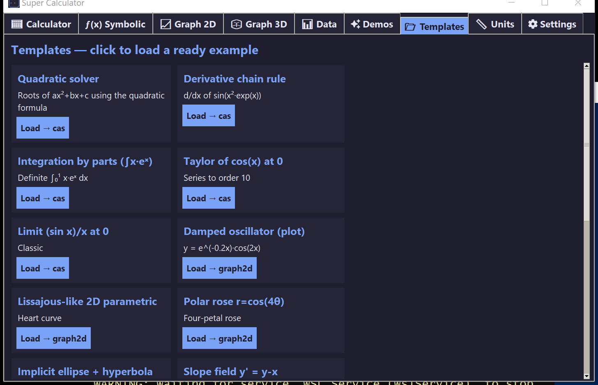

# 📂 Templates

Click-to-load examples covering algebra, calculus, ODEs, physics, statistics, finance, and number theory. Each card has a name, a one-line description, and a **Load** button that opens the example in the relevant tab.

## Inventory

| Template | Tab | What it loads |
|---------|-----|--------------|
| Quadratic solver | Symbolic | `a*x² + b*x + c` → Solve |
| Derivative chain rule | Symbolic | `d/dx sin(x² · eˣ)` |
| Integration by parts | Symbolic | `∫₀¹ x·eˣ dx` |
| Taylor of cos(x) | Symbolic | Series to order 10 at 0 |
| Limit (sin x)/x at 0 | Symbolic | Classic |
| Damped oscillator | Graph 2D | `e⁻⁰·²ˣ · cos(2x)` with envelope |
| Heart curve (parametric) | Graph 2D | The classic heart parametric |
| Polar rose r = cos(4θ) | Graph 2D | Four-petal rose |
| Conic sections | Graph 2D | Implicit ellipse and hyperbola |
| Slope field y' = y − x | Graph 2D | ODE direction field |
| Vector field (−y, x) | Graph 2D | Pure rotation |
| 3D ripple | Graph 3D | `sin(√(x² + y²))` |
| 3D saddle | Graph 3D | `x² − y²` |
| Complex domain coloring of z² | Graph 3D | Phase plot |
| Compound interest | Calculator | FV of $1000 at 5% for 30 years |
| RLC resonant frequency | Calculator | `1/(2π√(LC))` with L=10 mH, C=1 µF |
| Projectile range | Calculator | `v² sin(2θ)/g`, θ=45°, v=20 m/s |
| Prime factorize 360 | Symbolic | `factor(360)` |
