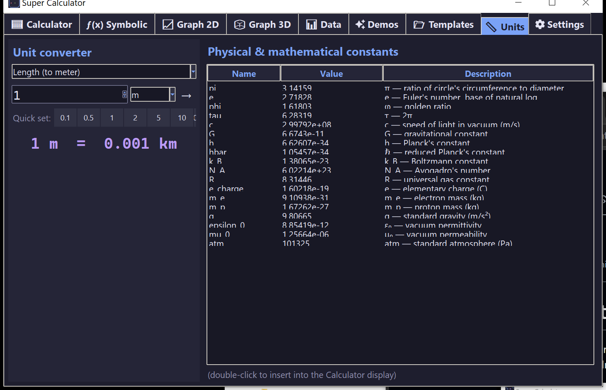

# 📏 Units & Constants

Two panels: a unit converter on the left, a physical constants table on the right.

## Unit converter

Seven categories:

| Category | Units |
|----------|-------|
| **Length** (to meter) | m, km, cm, mm, inch, ft, yd, mile, nm, μm, ly, AU, pc |
| **Mass** (to kg) | kg, g, mg, ton, lb, oz, stone |
| **Time** (to second) | s, ms, min, h, day, week, year |
| **Energy** (to joule) | J, kJ, cal, kcal, Wh, kWh, eV, BTU |
| **Pressure** (to Pa) | Pa, kPa, atm, bar, psi, torr, mmHg |
| **Data** (to byte) | B, KB, MB, GB, TB, bit |
| **Angle** (to radian) | rad, deg, grad, turn, arcmin, arcsec |

### Use

1. Pick a category.
2. Click a **Quick set** chip (`0.1`, `0.5`, `1`, `2`, `5`, `10`, `100`, `1000`) or type a value (spinbox accepts typed input).
3. Pick **from** and **to** units.
4. Result appears below.

Live conversion — every change to the value, the source unit, or the target unit triggers an immediate re-compute.

## Physical constants

17 entries with full descriptions. Sortable; double-click any row to insert the constant name into the Calculator display and jump there.

| Name | Approx. value | What it is |
|------|--------------|----------|
| `pi` | 3.14159 | π — circle constant |
| `e` | 2.71828 | Euler's number |
| `phi` | 1.61803 | Golden ratio |
| `tau` | 6.28318 | 2π |
| `c` | 2.998e8 m/s | Speed of light |
| `G` | 6.674e-11 | Gravitational constant |
| `h` | 6.626e-34 | Planck's constant |
| `hbar` | 1.055e-34 | Reduced Planck |
| `k_B` | 1.381e-23 | Boltzmann constant |
| `N_A` | 6.022e23 | Avogadro's number |
| `R` | 8.314 | Gas constant |
| `e_charge` | 1.602e-19 C | Elementary charge |
| `m_e` | 9.109e-31 kg | Electron mass |
| `m_p` | 1.673e-27 kg | Proton mass |
| `g` | 9.80665 m/s² | Standard gravity |
| `epsilon_0` | 8.854e-12 | Vacuum permittivity |
| `mu_0` | 1.257e-6 | Vacuum permeability |
| `atm` | 101325 Pa | Standard atmosphere |
